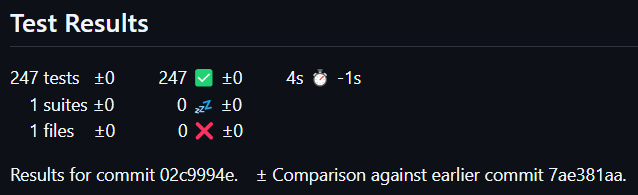

# publish-test-deltas

[](https://github.com/percebus/github-actions-testing/actions/workflows/test_actions__publish-test-deltas.yml)

[`LICENSE`](./LICENSE)

## permissions

[Permissions](https://github.com/EnricoMi/publish-unit-test-result-action?tab=readme-ov-file#permissions)

### Public GitHub Repositories

```yaml
permissions:
  checks: write
  pull-requests: write
```

### Private GitHub Repositories

```yaml
permissions:
  contents: read
  issues: read
  checks: write
  pull-requests: write
```

## Screenshots

### summary



## References

### GitHub

[`EnricoMi`](https://github.com/EnricoMi/) / [`publish-unit-test-result-action`](https://github.com/EnricoMi/publish-unit-test-result-action)
