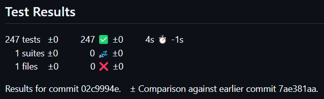

# publish-test-results

## Screenshots

### summary

## References

### GitHub

[`EnricoMi`](https://github.com/EnricoMi/) / [`publish-unit-test-result-action`](https://github.com/EnricoMi/publish-unit-test-result-action)
