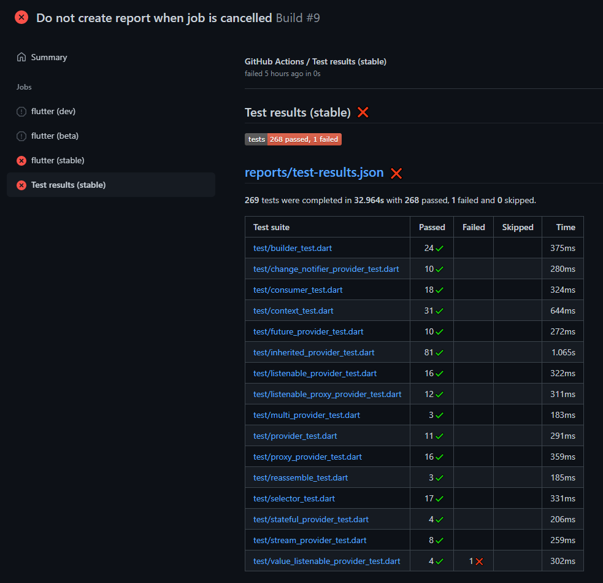
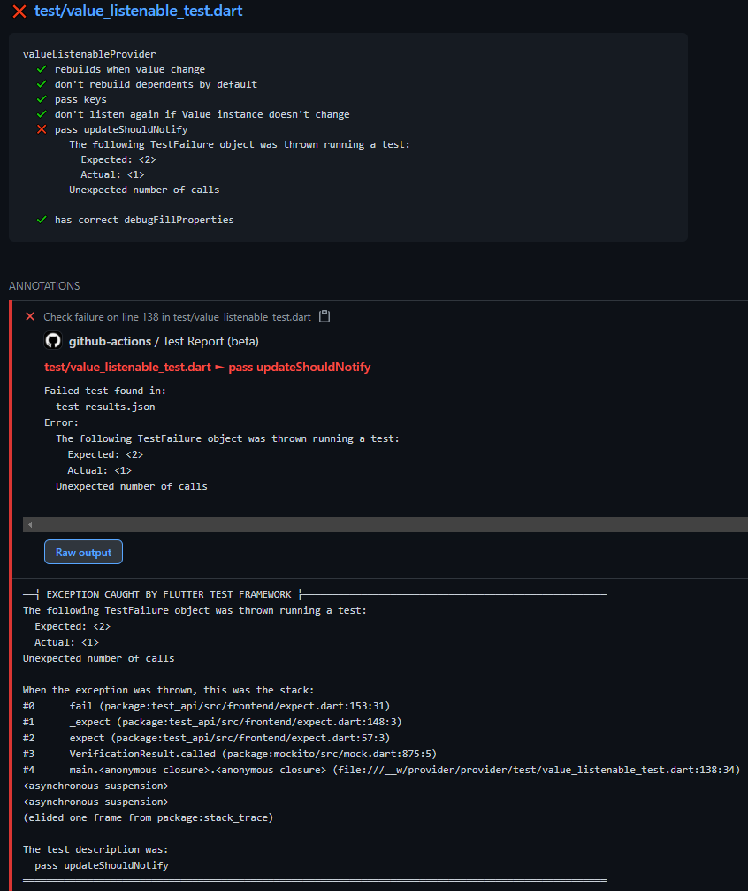

# test-reporter

## permissions

[Recommended setup for public repositories](https://github.com/dorny/test-reporter?tab=readme-ov-file#recommended-setup-for-public-repositories)

```yaml
permissions:
  contents: read
  actions: read
  checks: write
```

## Screenshots

### Provided Error

#### Summary



#### Details



## References

### GitHub

[`dorny`](https://github.com/dorny) / [`test-reporter`](https://github.com/dorny/test-reporter)
