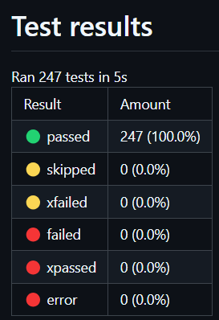

# test-summary

[`LICENSE`](./LICENSE)

## Screenshots

### Summary

## References

### GitHub

[`pmeier`](https://github.com/pmeier) / [`pytest-results-action`](https://github.com/pmeier/pytest-results-action)
